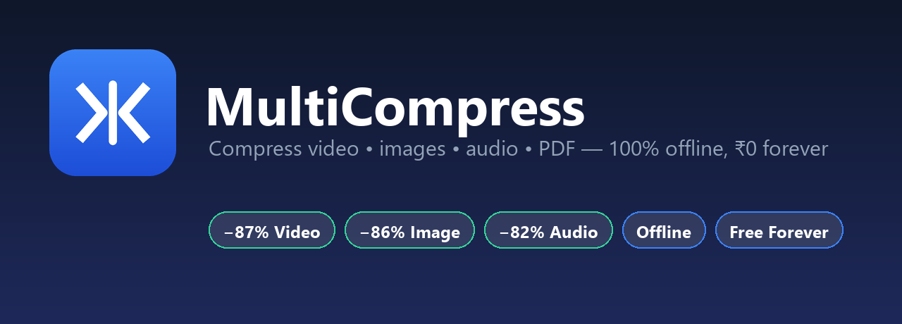

<p align="center">
  
</p>

<h1 align="center">🗜️ MultiCompress</h1>

<p align="center">
  <b>A 100% free, 100% offline desktop app to compress videos, images, audio, PDFs and any file —<br>
  no quality headaches, no watermarks, no upload to anyone's cloud.</b>
</p>

<p align="center">
  
  
  
  
  
</p>

Built with Python + FFmpeg. No subscriptions, no internet required. **Your files never leave your computer.**

---

## ✨ Features

- 🎯 **Target-size mode (MB *or* KB)** — *"make this under 25 MB"* or *"this photo under 50 KB"*. Perfect for email limits **and government / exam form uploads** (passport photo, signature, PDF size limits). The feature paid tools charge for — free here.
- 🎬 **Video** — H.264 re-encode with resolution capping (real example: **748 MB → 94 MB, −87%**)
- 🖼️ **Images** — JPEG/PNG/WebP + **HEIC (iPhone photos)**, smart resize (real example: **10 MB → 1.4 MB, −86%**)
- 🎵 **Audio** — MP3 re-encode at chosen bitrate (**−80%** on WAV)
- 📄 **PDF** — downsamples embedded images; target an exact KB size for portals
- 📦 **Any file/folder** — falls back to high-ratio `.7z` archiving
- 🛡️ **Bulletproof** — handles locked/empty/huge files gracefully, shows real error reasons, writes a debug log
- 🖱️ **Drag & drop** + batch processing (compress dozens at once)
- ⚡ **Parallel compression** — uses multiple CPU cores (**~3.3× faster** batches)
- 👁️ **Before/after preview** for images, plus an upfront reduction estimate
- 🎚️ **Presets** (High Quality / Balanced / Small / Instagram / Email) **+ Advanced manual sliders**
- ⏹️ **Live progress bars** and a **Stop** button for long jobs
- 📊 **Lifetime stats**, remembered settings, light/dark theme
- 🧵 **Multithreaded** — the window never freezes
- 💾 **Handles huge files** — streams through disk; a 50 GB video never loads into RAM
- 🪟🍎🐧 **Cross-platform** — Windows, macOS and Linux

---

## ⬇️ Download & Install (Windows — no Python needed)

1. Go to the **[Releases page](https://github.com/sourabh-jangid-dev/multicompress/releases/latest)** and download **`MultiCompress-v1.0.0.zip`**.
2. **Unzip** it anywhere.
3. Double-click **`MultiCompress.exe`**. That's it — FFmpeg is bundled inside, nothing else to install.

### ⚠️ "Windows protected your PC"? — it's safe, here's why

When you run it the first time, Windows **SmartScreen** may show a blue warning. This is **normal for every new open-source app** — it appears because the app isn't signed with an expensive certificate yet, *not* because it's harmful.

**To run it:** click **"More info"** → **"Run anyway."**

You can verify it's safe yourself: the **full source code is right here in this repo**, and the app makes **zero internet connections** — everything happens offline on your machine. The warning will disappear on its own as more people download it. 🛡️

---

## 🎥 Demo

<p align="center">
  
</p>

> **To record this GIF (2 minutes, free):**
> 1. Download **[ScreenToGif](https://www.screentogif.com/)** (free, open-source).
> 2. Run `python main.py`, hit Record, then **drag a video in → pick a preset → Compress All**.
> 3. Stop, trim, and **Save As `docs/demo.gif`**. Commit it — GitHub shows it automatically.

---

## 🚀 Quick Start (from source)

```bash
# 1. Clone
git clone https://github.com/sourabh-jangid-dev/multicompress.git
cd multicompress

# 2. Install dependencies (FFmpeg comes bundled via pip — no manual install!)
pip install -r requirements.txt

# 3. Run the app
python main.py
```

### Command-line version

```bash
python cli.py video.mp4 photo.jpg scan.pdf --preset small --output ./out
python cli.py --help
```

---

## 🏗️ Architecture

The GUI and CLI both call **one entry point** (`engine.py`), which routes each
file to the right compressor. Nothing in the UI knows about FFmpeg or Pillow —
clean separation of concerns.

```
main.py / cli.py
        │
        ▼
  engine.compress_path()        ← the dispatcher ("brain")
        │
        ├── image_compressor.py   (Pillow + pillow-heif)
        ├── pdf_compressor.py     (PyMuPDF)
        ├── video_compressor.py ─┐(FFmpeg)
        ├── audio_compressor.py ─┘ via ffmpeg_runner.py (shared, cancellable)
        └── archive_compressor.py (py7zr)

  presets.py · config.py · history.py · utils.py   ← supporting modules
  gui/app.py                                        ← the window
```

| Module | Responsibility |
|---|---|
| `engine.py` | Detects file type, routes to the correct compressor, logs history |
| `ffmpeg_runner.py` | Runs FFmpeg, parses live progress, supports cancellation |
| `presets.py` | Maps human intent (“Instagram”) → technical settings (CRF, DPI…) |
| `utils.py` | Streaming-safe file ops, size formatting, output paths |
| `config.py` / `history.py` | Remembered settings + lifetime stats (JSON in `~/.multicompress`) |
| `gui/app.py` | The desktop window (threaded, drag-drop) |

---

## 🧪 Tests

```bash
pip install -r requirements-dev.txt
pytest -q
```

---

## 📦 Build a standalone `.exe`

```bash
pip install -r requirements-dev.txt
python build_exe.py
```

The bundled app (with FFmpeg inside) appears in `dist/MultiCompress/`.
Zip that folder and attach it to a **GitHub Release** so anyone can download
and run it — no Python needed.

### 🖱️ Add a right-click menu (Windows)

```bash
python install_context_menu.py            # adds "Compress with MultiCompress"
python install_context_menu.py --remove   # removes it
```

Then right-click **any file** in Explorer → **Compress with MultiCompress** →
the app opens with that file already queued. (Uses `HKEY_CURRENT_USER`, so no
admin rights needed.)

### 💿 Build a real Setup.exe (optional)

Install the free [Inno Setup](https://jrsoftware.org/isdl.php), then:

```bash
python build_exe.py          # 1. build the app folder
ISCC installer.iss           # 2. compile the installer
```

Produces `MultiCompress-Setup-1.0.0.exe` — Start Menu shortcut, desktop icon,
optional right-click menu, and a clean uninstaller.

### 🍎🐧 macOS & Linux

The code is cross-platform. To build a native app, run the **same** command **on
that OS** (PyInstaller can't cross-compile):

```bash
pip install -r requirements-dev.txt
python build_exe.py        # produces a macOS .app / Linux binary in dist/
```

The right-click menu (`install_context_menu.py`) is Windows-only; everything
else — compression, GUI, drag-drop, presets, parallel jobs — works everywhere.

### 🌐 Project website (free)

A ready-made landing page lives in [`docs/index.html`](docs/index.html).
Enable **GitHub Pages → Deploy from branch → `/docs`** in your repo settings and
it goes live at `https://sourabh-jangid-dev.github.io/multicompress/`.

---

## 🛠️ Tech Stack

Python · FFmpeg (`imageio-ffmpeg`) · Pillow · pillow-heif · PyMuPDF · py7zr · CustomTkinter · tkinterdnd2

---

## 📄 License

MIT — see [LICENSE](LICENSE). Includes a third-party notice for FFmpeg (LGPL/GPL).

---

> Made as a free tool for creators, students and anyone who shouldn't have to pay
> to make a file smaller. Contributions welcome — open an issue or PR!
